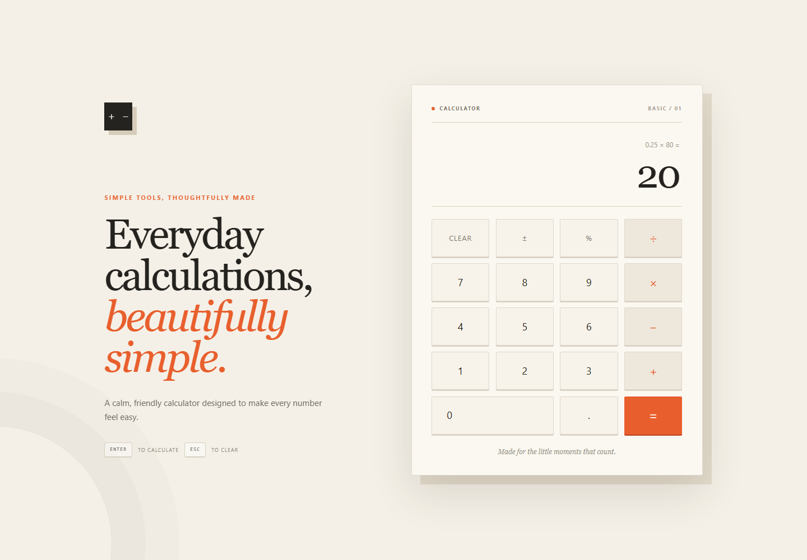

# Learn by example

## Split a bill

Four people share a bill of 1,260.

```text
1260 ÷ 4 = 315
```

Each person pays **315**.

## Calculate a discount

Find 20% of an item costing 750.

```text
20 % × 750 = 150
```

The discount is **150**. To find the final price:

```text
750 − 150 = 600
```

## Add expenses

<figure class="app-shot" markdown>
  
  <figcaption>A percentage example keeps the completed expression visible above its result.</figcaption>
</figure>

Add travel costs of 245, 80, and 125.

```text
245 + 80 + 125 = 450
```

After entering `245 + 80`, select `+` again. The calculator carries the result forward before you enter `125`.

## Work with a negative value

<figure class="app-shot" markdown>
  
  <figcaption>A completed addition uses the same expression-and-result layout as longer everyday calculations.</figcaption>
</figure>

A balance of 35 is reduced by a charge of 50.

```text
35 − 50 = -15
```

The negative result means the balance is **15 below zero**.

## Practice exercises

Try these before revealing the answers.

??? question "1. What is 18 × 7?"
    `18 × 7 = 126`

??? question "2. Split 945 equally among 5 people."
    `945 ÷ 5 = 189`

??? question "3. Find 12% of 600."
    `12 % × 600 = 72`
