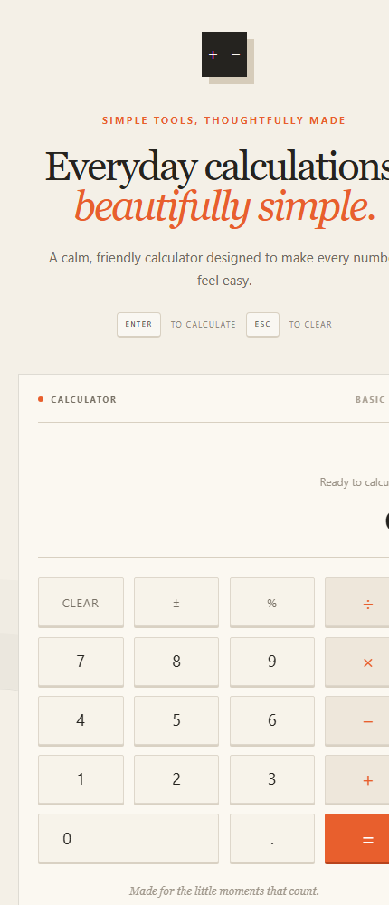

# Getting started

You do not need to install anything. The calculator runs in a modern web browser on a computer, tablet, or phone.

## Open the calculator

Visit [Simple Everyday Calculator](https://techwriterp.github.io/calculator/). The page has an introduction on the left and the calculator on the right. On a narrow screen, the calculator moves below the introduction.

<figure class="app-shot" markdown>
  
  <figcaption>Desktop view: the calculator sits beside a short introduction and keyboard hints.</figcaption>
</figure>

## Take a quick tour

The calculator has three main areas:

1. **Expression line** — shows the calculation being prepared or the last calculation completed.
2. **Result display** — shows the number you are entering and the final answer.
3. **Keypad** — contains numbers, operations, and utility controls.

## Complete your first calculation

<figure class="app-shot" markdown>
  
  <figcaption>Small-screen view: the introduction and calculator stack vertically while the controls remain large enough to tap.</figcaption>
</figure>

To calculate `12 + 8`:

1. Select ++1++ and ++2++.
2. Select the ++plus++ button.
3. Select ++8++.
4. Select ++equals++.

The result display shows **20**, and the expression line shows `12 + 8 =`.

<figure class="app-shot" markdown>
  
  <figcaption>After selecting equals, the expression remains above the large result so you can check the calculation.</figcaption>
</figure>

!!! note
    Selecting a number after a completed calculation starts a new calculation.

## Clear and try again

Select **Clear** at any time to return the calculator to `0`. On a keyboard, press ++esc++ or ++c++.

## Where to go next

- Read [Using the calculator](using-the-calculator.md) for every control.
- Try practical tasks in [Learn by example](examples.md).
- Read [Errors and limitations](errors-and-limitations.md) if a result behaves unexpectedly.
